# Introduction 
This is a demo code implementation for **Nonlinear RISE based Integral Reinforcement Learning algorithms for perturbed Bilateral Teleoperators with variable time delay.** The full code will be updated soon!

We proposed two Reinforcement Learning (RL) based control frames including On Policy and Off Policy based Robust Integral of the Sign of the Error (RISE) after employing the sliding variable to reduce the order of a BT dynamic model, which makes it easier to obtain control designs. We compare our proposed with the existing controller and the results demonstrate the effectiveness of the proposed control frameworks.
- Code for Off Policy based control: [Off-Policy](https://github.com/ZQuang2202/Reinforcement-learning-based-control-for-BTs/tree/main/Off_Policy)
- Code for On Policy based control: [On-Policy](https://github.com/ZQuang2202/Reinforcement-learning-based-control-for-BTs/tree/main/On_Policy)

# Methods

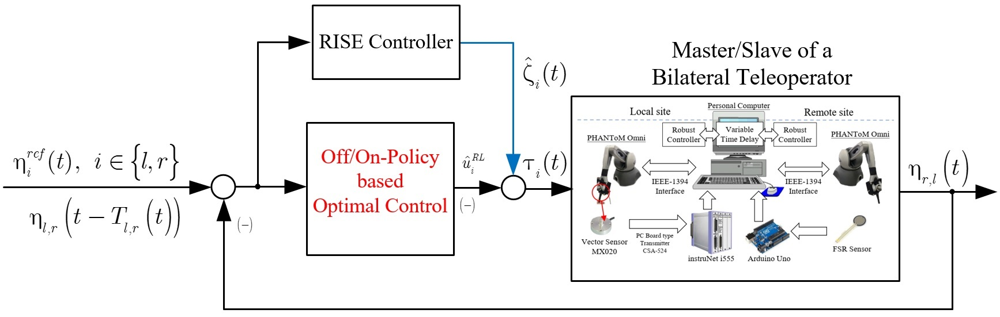

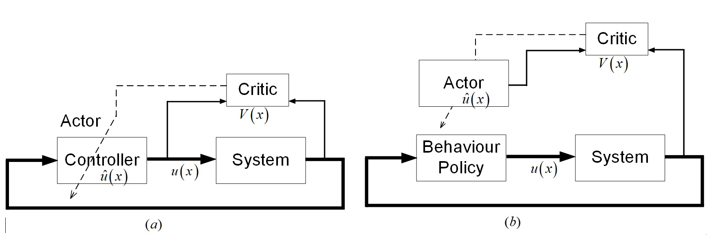

# Result
## Off Policy
Joint angles of Master robot and Slave robot using two different controllers. Solid line for one using OFF Policy technique and dashed line for one using finite-time controller.
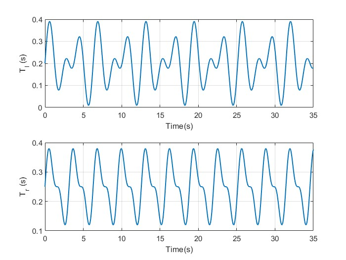
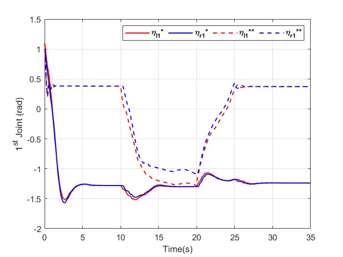
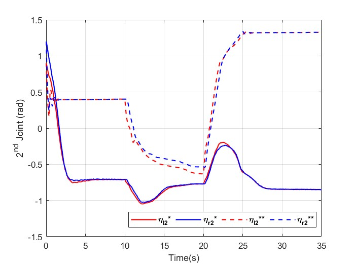
Tracking error. Blue line for finite time control and Red line for RISE based Off-Policy Algorithm.
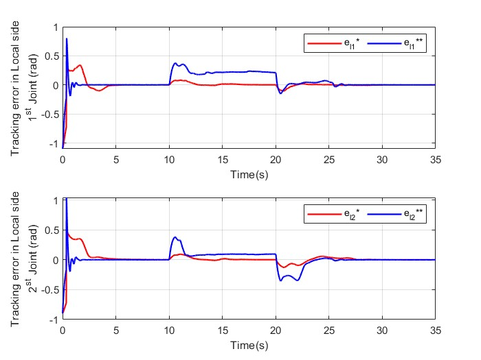
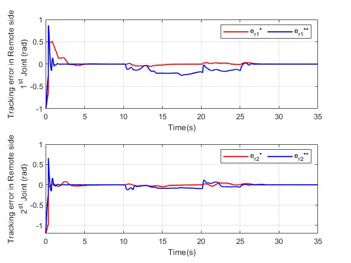
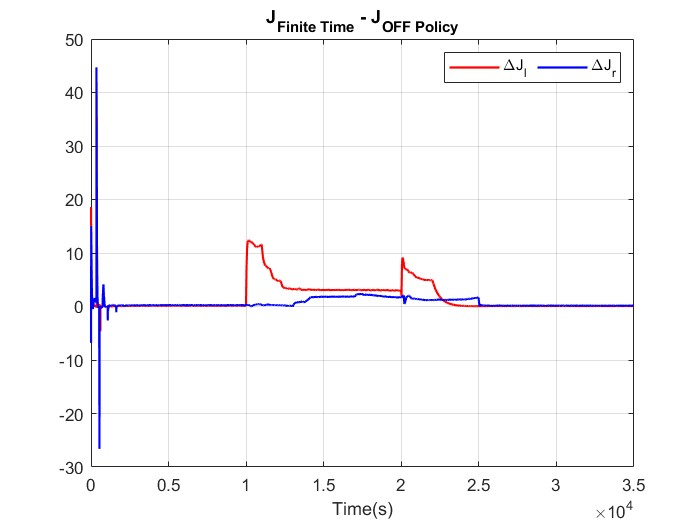
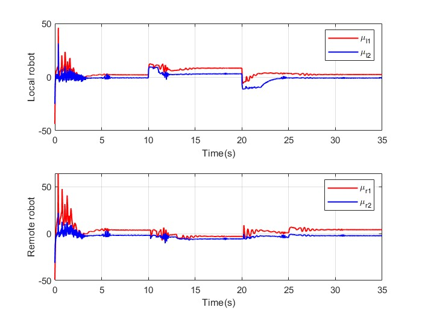
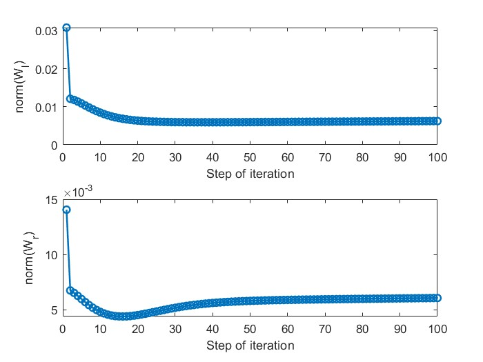
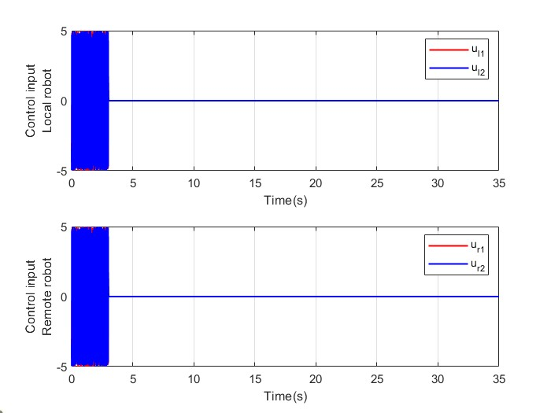

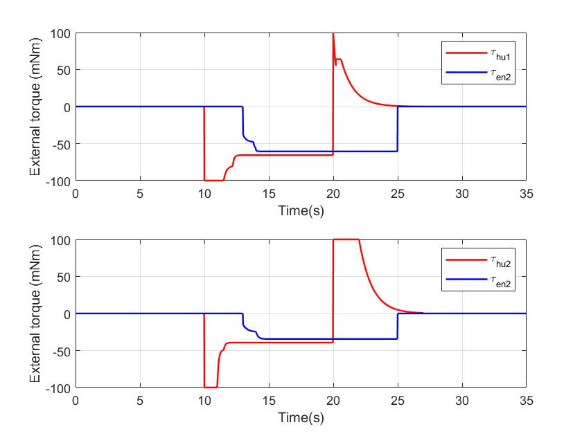
## On Policy
Joint angles of Master robot and Slave robot using two different controllers. Solid line for one using OFF Policy technique and dashed line for one using finite-time controller.
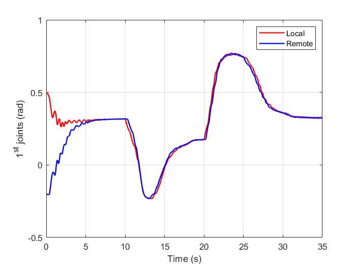
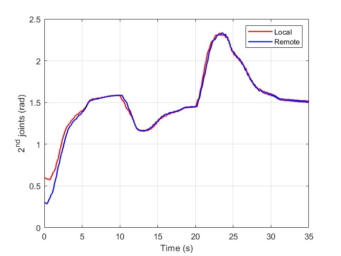
Tracking error. Blue line for finite time control and Red line for RISE based Off-Policy Algorithm.
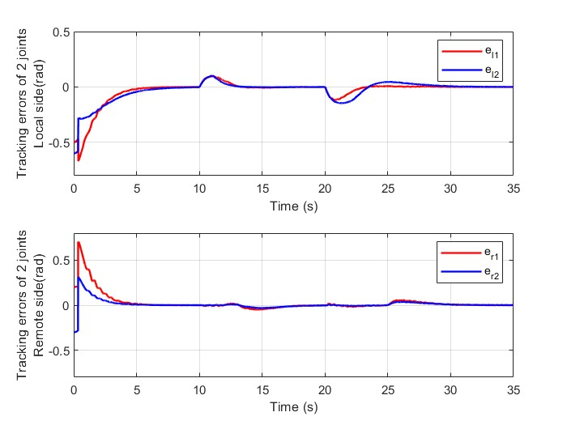
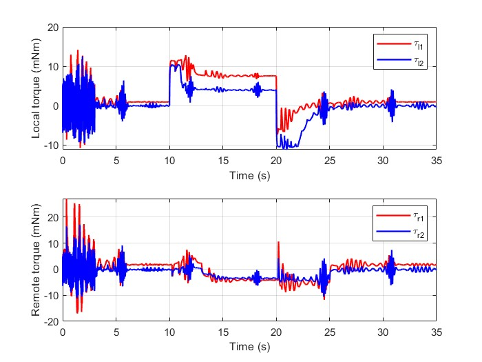
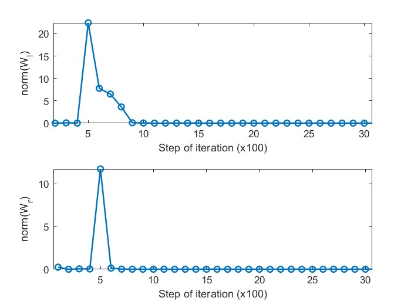
# Finite time control 
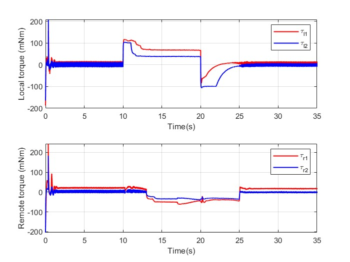
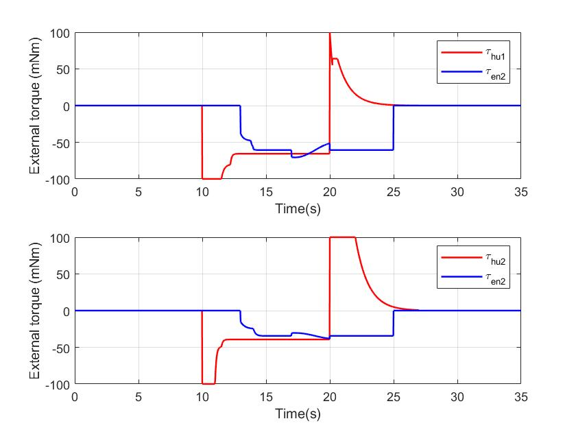
